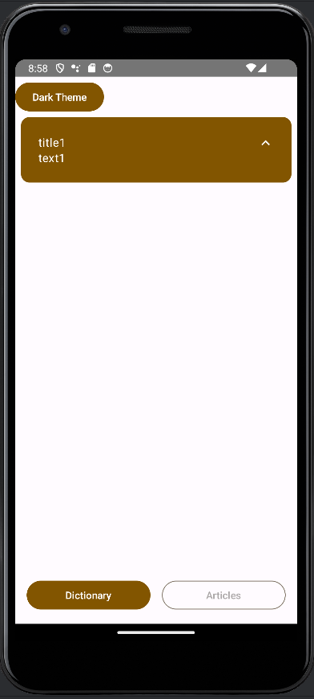
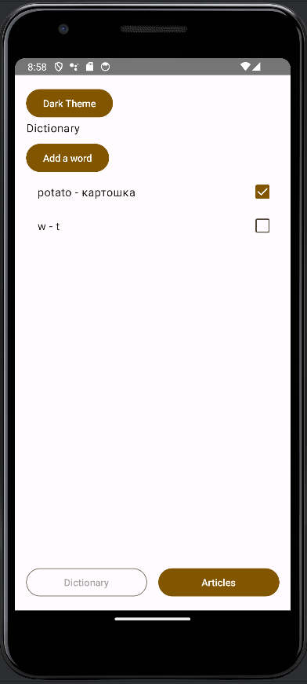
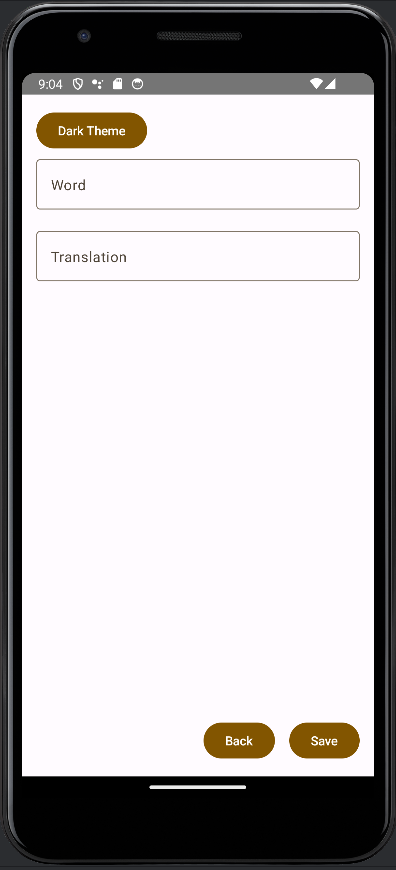
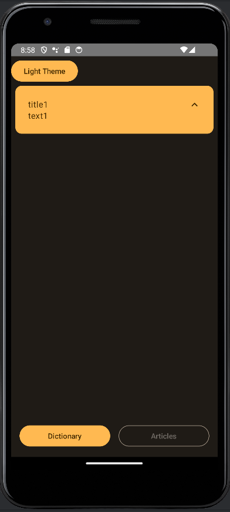

# App for studying languages

### Screens:

#### Articles on different topics to learn the language

#### Personal dictionary for every user

Options:
* add a new word
* mark word as learned

### Features

* change theme (light/dark)
  
* Russian language available
* Firebase Firestore as Database
* Crashlytics
* ktlint

### Further project development:

* add profile screen
* add login screen with possibility to log in through Google
* add learning cards for words
